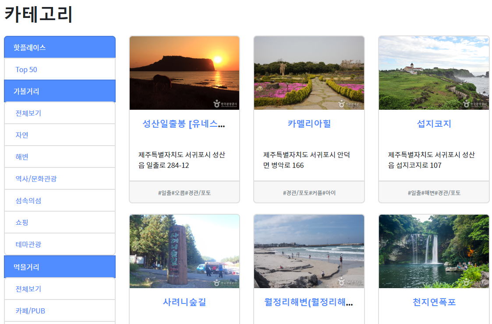
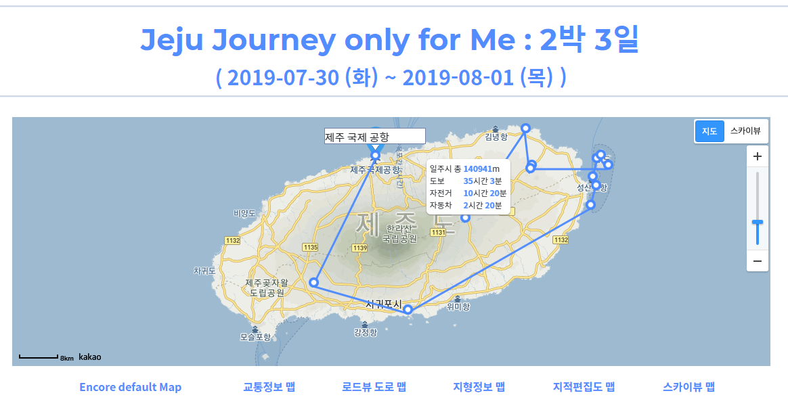
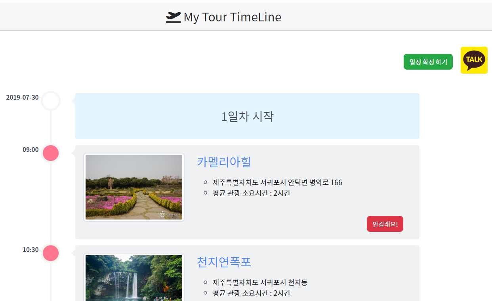
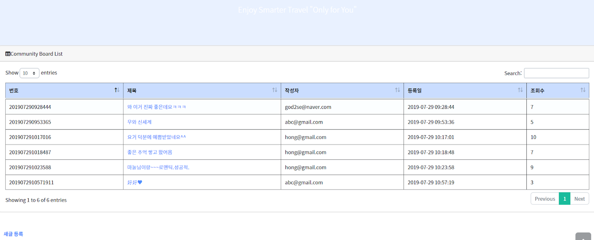

# Jeju_Project

+ Project 주제 : 나만의 제주도 여행 Planner

+ Project 개요  
        - 테마별 여행정보 조회 기능  
        - 사용자가 선호하는 여행 Theme을 Base로 장소 추천 
        - 최단 경로를 계산하여 최적 경로 추천 
        - 경로 카카오톡 공유 기능 
        - Community 게시판 
        
        

+ Project 기간 : 2019.07.08 ~ 2019.07.29

+ 개발 환경 
    - Language : Java 8.0 , JavaScript, HTML, CSS, JSP  
    - Framework : Spring 3.0, BootStrap 4 , MyBatis  
    - DB : Oracle  
    - Library : JQuery  
    - WAS : Apache Tomcat 9.0  
    
+ 데이터 수집 :  한국관광공사 공공 API + 제주관광공사 공식 Site 크롤링

+ 구현 화면 

 

